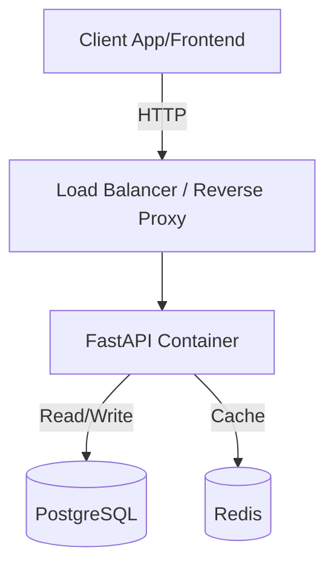

# 🎓 University Intranet API (Next Gen)

> A high-performance, Modern API simulation for university services, designed to outperform legacy systems.


## 🚀 Overview

The **University Intranet API** is a project born from the necessity for speed and reliability. Traditional university portals are often slow and cumbersome. This project aims to provide a **lightning-fast API** interface for common student needs:
- **Grades**: Real-time access to academic performance.
- **Schedules**: Optimized weekly planning.
- **Subjects**: Course management and information.

Built with **Scalability** and **Performance** in mind, leveraging the modern Python async ecosystem.

## 🛠️ Tech Stack (The "Next Level" Suite)

We are using industry-standard, high-performance tools:

- **Framework**: [FastAPI](https://fastapi.tiangolo.com/) (Asynchronous, Type-safe)
- **Database**: [PostgreSQL](https://www.postgresql.org/) (Robust relational data)
- **ORM**: [SQLModel](https://sqlmodel.tiangolo.com/) (Interaction with DB)
- **Caching**: [Redis](https://redis.io/) (For sub-millisecond response times)
- **Containerization**: [Docker](https://www.docker.com/) & Docker Compose (Consistent environments)
- **Migrations**: [Alembic](https://alembic.sqlalchemy.org/en/latest/) (Database schema management)
- **Testing**: [Pytest](https://docs.pytest.org/) (Reliability)

## 📋 Requirements & Features

### Core Modules
1.  **Authentication & Security** 🔐
    - JWT (JSON Web Tokens) based auth.
    - Role-based access (Student, Professor, Admin).
    - Password hashing with Bcrypt.

2.  **Academic Services** 📚
    - **View Grades**: Detailed breakdown of grades per subject.
    - **Schedule**: Weekly calendar view.
    - **Subjects**: Syllabus and credit information.

3.  **Performance & System** ⚡
    - **Redis Caching**: Cache heavily accessed read-only data (like schedules).
    - **Health Checks**: Monitoring endpoints for deployment.

## 🔮 Roadmap & Scalability

How do we take this to production and beyond?

1.  **Horizontal Scaling**:
    - The API is stateless. We can spin up multiple containers behind a Load Balancer (Nginx/Traefik).
2.  **Database Optimization**:
    - Use Read Replicas for heavy `GET` traffic.
    - Implement Connection Pooling (PgBouncer) for high concurrency.
3.  **Observability**:
    - Integration with **Prometheus** and **Grafana** for real-time metrics.
    - **Sentry** for error tracking.
4.  **Background Tasks**:
    - Use **Celery** or **ARQ** for email notifications or heavy data processing (e.g., generating PDF report cards).

## 🏃‍♂️ Quick Start

```bash
# Clone the repository
git clone <repo-url>

# Start with Docker Compose (Instant Environment)
docker compose up -d --build

# Access Documentation
# Go to http://localhost:8000/docs
```

## 📂 Project Structure


